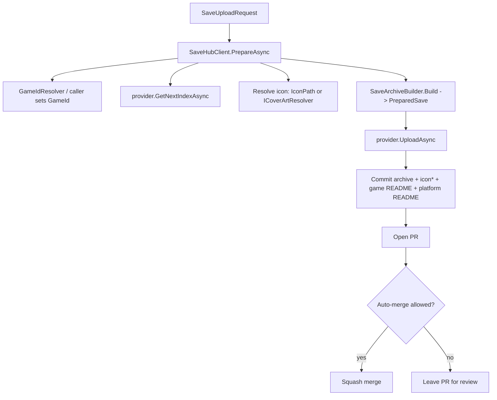

# SaveHub API & Format Specification

This document describes SaveHub completely enough to:

- **Reimplement it** in any language (the on-disk / repository **wire format** and the
  behavioural rules are fully specified), and
- **Extend the .NET library** (the public **API surface** of `SaveHub.Core` and how to
  add a storage provider).

It is split into two parts:

- [Part A — Format specification (language-agnostic)](#part-a--format-specification)
- [Part B — .NET API reference](#part-b--net-api-reference)

Version: matches `SaveHubInfo.Version` (`0.1.0`).

---

## Part A — Format specification

Any tool that follows the rules below produces a repository/bucket that is
interchangeable with the reference implementation.

### A.1 Repository layout

```
<PLATFORM>/
  README.md                 # platform games index (one row per game)
  <GAME-ID>/
    README.md               # per-game saves index (one row per archive)
    <NN>.zip                # a memory card (one card per zip)
    <NN>-sstate.zip         # a save state (one state per zip; may hold many files)
    icon.<ext>              # cover art for the game (single image, optional)
```

- `<PLATFORM>` — folder name for a console/handheld (e.g. `PS1`, `PS2`, `GBA`, `DS`).
  Any string is allowed; there is no fixed enumeration.
- `<GAME-ID>` — the game's serial / title id (e.g. `SCUS-97199`), used as the folder
  name. See [A.4 Game-id resolution](#a4-game-id-resolution).
- `<NN>` — a zero-padded, 1-based incremental index (`01`, `02`, ...).

### A.2 Archive naming

| Save type | Archive name | Example |
| --- | --- | --- |
| Memory card | `<NN>.zip` | `01.zip` |
| Save state | `<NN>-sstate.zip` | `01-sstate.zip` |
| Save folder | `<NN>-folder.zip` | `01-folder.zip` |

- Index padding: **2 digits** minimum (`D2`); larger numbers keep their digits.
- Save-state suffix: **`-sstate`** (lowercase), inserted before `.zip`.
- The next index for a (game, save-type) is `max(existing index of that type) + 1`,
  starting at `1`. Memory cards and save states are numbered **independently**.
- Parsing rule: strip `.zip`; if it ends with `-sstate`, it is a save state and the
  remainder is the index; otherwise it is a memory card.

### A.3 Folder / id sanitization

When turning a platform or game id into a folder name, keep
`A–Z a–z 0–9 - _ .` unchanged and replace every other character (including spaces)
with `-`. Trim surrounding whitespace first.

### A.4 Game-id resolution

Given `platform`, `saveType`, the `files`, an optional explicit **title id**, and an
optional **game name**, the folder game id is chosen in this order:

1. **Explicit title id** (if provided) — sanitized, always wins.
2. **PS1 / PS2 memory card** — serial read from the card image (see
   [A.5](#a5-playstation-serial-detection)).
3. **PS3 / PS4 / PS5 / PSP / Vita** — `TITLE_ID`/`DISC_ID` from a `PARAM.SFO` among
   the files (see [A.5.1](#a51-param-sfo-title-id)).
4. **Game name** (if provided) — sanitized. This is the path for **Nintendo** saves.
5. **Game name from the save** — `PARAM.SFO` `TITLE`, when present.
6. **`Unknown`** — a last-resort folder inside the platform (e.g. `PS2/Unknown/`).

**Detection support matrix**

| Platform / case | Auto id source | Auto cover art | Notes |
| --- | --- | --- | --- |
| PS1 memory card | Serial from card | Yes (PS1 covers) | `SLUS-#####` etc. |
| PS2 memory card | Serial from card | Yes (PS2 covers) | `SCUS-97199` etc. |
| PSP | `DISC_ID`/`TITLE_ID` from `PARAM.SFO` | Yes (PSP covers) | id e.g. `NPEG00001` |
| PS3 / PS4 / PS5 / Vita | `TITLE_ID` from `PARAM.SFO` | No (no source yet) | `BLUS30490`, `CUSA12345` |
| GBA and other Nintendo | **Game name** (user) or `Unknown` | No | a `.sav` has no title id (see below) |
| Save states / anything else | Game name or `Unknown` | Depends on platform | provide a name for a tidy folder |

> **GBA `.sav`:** a raw battery/SRAM dump has no header, game code, or title id (the
> 4-char code lives in the ROM header at `0xAC`, not the save), so supply a **game
> name** and the save is filed by name; otherwise it goes to `Unknown`.

### A.5 PlayStation serial detection

Scan the memory-card bytes decoded as ISO-8859-1 (Latin-1, 1:1 byte mapping) for the
regular expression:

```
(SLUS|SCUS|SLES|SCES|SLPS|SLPM|SCPS|SCAJ|SCKA|SLKA|SLAJ|SLED|SCED|PBPX|PAPX|PCPX)[-_ ]?([0-9]{5})
```

- Normalize each match to `PREFIX-NNNNN` (uppercase prefix, single dash).
- If several distinct serials are found, pick the **most frequent** (ties broken
  alphabetically). Callers should allow an explicit override for multi-game cards.

Rationale: PS1 cards store product codes like `BASLUS-00190…`, and PS2 cards store
save folders like `BASCUS-97199…`; the serial appears verbatim in both.

#### A.5.1 PARAM.SFO title id

PS3/PS4/PS5/PSP/Vita saves include a binary `PARAM.SFO` metadata file. Parse it and
read the game id from the first present key of: `TITLE_ID`, then `DISC_ID`.

`PARAM.SFO` layout: 20-byte header (magic `\0PSF` = `00 50 53 46`, version,
`key_table_start` u32 @0x08, `data_table_start` u32 @0x0C, `entries` u32 @0x10),
then `entries` index records of 16 bytes (`key_offset` u16, `data_fmt` u16,
`data_len` u32, `data_max_len` u32, `data_offset` u32), then the key table
(null-terminated ASCII) and the data table. `data_fmt` `0x0204`/`0x0004` = UTF-8
string, `0x0404` = uint32.

### A.6 Archive (zip) contents

Each archive contains:

1. The raw save file(s), stored by their **base file name** (collisions get `_1`,
   `_2`, … suffixes). Memory cards must be exactly one file; save states may be many.
2. A manifest named **`README.txt`** describing the save.

**Manifest template** (`README.txt`):

```
SaveHub Save
============

Platform:     PS2
Game ID:      SCUS-97199
Game Title:   Ratchet & Clank        (omitted if unknown)
Type:         Memory Card | Save State
Archive:      01.zip
Emulator:     PCSX2                   (omitted if unknown)
Created:      2026-08-16 08:22:16 UTC

Description:
  <one-line description>

Files:
  - <file name>
  - ...

Note:                                 (save states only)
  Save states are usually emulator-specific and often NOT interchangeable
  between emulators. Use the emulator named above.

Notes:                                (only if provided)
  <free-form notes>

Created with SaveHub - <project url>
```

### A.7 Per-game `README.md`

Path: `<PLATFORM>/<GAME-ID>/README.md`. Regenerated on each upload from the parsed
existing rows plus the new/updated row (keyed by archive name, ordered by type then
name). Template:

```markdown
# <Game Title> (<GAME-ID>)        # or just "<GAME-ID>" when no title

                # only when an icon exists in the folder

Platform: <PLATFORM>

Saves stored in this folder:

| Save | Type | Description |
| --- | --- | --- |
| [01.zip](01.zip) | Memory Card | <description> |
| [01-sstate.zip](01-sstate.zip) | Save State | <description> |

_Maintained by SaveHub._
```

Descriptions are single-line (CR/LF collapsed to spaces, `|` escaped as `\|`).

### A.8 Per-platform `README.md`

Path: `<PLATFORM>/README.md`. Games index, one row per game, ordered by title id:

```markdown
# <PLATFORM> Saves

Games with memory cards or save states stored in this `<PLATFORM>` folder.
Each row links to the game's folder, named by its title id.

| Title ID | Game |
| --- | --- |
| [SCUS-97199](SCUS-97199) | Ratchet & Clank |

_Maintained by SaveHub._
```

### A.9 Cover art

When no user image is supplied, tools may download cover art by serial:

| Platform | URL template | Ext | Serial format |
| --- | --- | --- | --- |
| PS1 | `https://raw.githubusercontent.com/xlenore/psx-covers/main/covers/default/{serial}.jpg` | `.jpg` | `SLUS-00190` |
| PS2 | `https://raw.githubusercontent.com/xlenore/ps2-covers/main/covers/default/{serial}.jpg` | `.jpg` | `SLUS-20073` |
| PSP | `https://raw.githubusercontent.com/Andiweli/HexFlow-Covers/main/Covers/PSP/{serial}.png` | `.png` | `NPEG00001` |

Rules:
- Store as `icon.<ext>` in the game folder.
- A user-supplied image overrides the download and keeps its own extension.
- **Reuse rule:** if the game folder already contains an `icon.*`, do **not**
  re-upload one for auto covers; reference the existing file in the per-game
  `README.md`. A **user-supplied** icon always overwrites.
- A missing cover is non-fatal; the save uploads without an icon.

### A.10 Configuration schema

JSON, per-user or per-project. The library ships with a CLI default of
`./savehub.config.json` (current working directory).

```json
{
  "activeProvider": "github",
  "providers": {
    "github": {
      "owner": "Uncle-Uee",
      "repository": "Emu-Saves-Backup",
      "branch": "",                       // empty => provider default branch
      "token": null,                       // prefer the env var below
      "tokenEnvironmentVariable": "SAVEHUB_GITHUB_TOKEN",
      "autoMerge": false,
      "committerName": null,
      "committerEmail": null
    }
  }
}
```

`providers` is an open map: each backend defines its own settings object under its
provider key. `activeProvider` selects which one is used.

### A.11 Publish / review semantics

Every upload is a **reviewable change**:

- Changes are submitted as a pull request (GitHub) or an equivalent (e.g. a
  `pending/` prefix for object stores).
- **Auto-merge** happens only when the backend allows it *and* the config
  `autoMerge` switch is on *and* the user has write access. Effective rule:
  `merge = (perUploadChoice ?? configAutoMerge) && configAutoMerge && hasWriteAccess`.
- Users **without** write access contribute via a fork (GitHub) or a pending area;
  the owner/contributors review and merge.

### A.12 Editing and downloading

- **Edit / replace:** to update an existing save without adding a new one, upload
  using the same index as the target archive (e.g. index `1` overwrites `01.zip`).
  The per-game `README.md` row for that archive is updated with the new description;
  the icon is left alone unless the user explicitly supplies one.
- **Download:** fetch the raw bytes of any archive at its repository path
  `PLATFORM/GAMEID/NN.zip` (GitHub: the raw content endpoint).

---

## Part B — .NET API reference

Target framework: **.NET 8+** (repo uses .NET 10). Assemblies:

- `SaveHub.Core` — models, archive/index building, config, provider abstraction.
- `SaveHub.GitHub` — the GitHub provider (Octokit).
- `SaveHub.WinForms` — Windows desktop frontend (not part of the API surface).

### B.1 Namespaces at a glance

| Namespace | Key types |
| --- | --- |
| `SaveHub.Core` | `SaveHubClient`, `SaveHubInfo` |
| `SaveHub.Core.Models` | `SaveType`, `KnownPlatforms`, `SaveUploadRequest`, `SaveEntry` |
| `SaveHub.Core.Abstractions` | `ISaveStorageProvider`, `StorageProviderCapabilities`, `UploadOptions`, `SaveUploadResult`, `ConnectionTestResult` |
| `SaveHub.Core.Archiving` | `SaveNaming`, `StorageFile`, `PreparedSave`, `SaveArchiveBuilder`, `SaveManifest`, `GameReadmeFormatter`, `PlatformReadmeFormatter`, `CoverArt`, `CoverArtSource`, `ICoverArtResolver`, `HttpCoverArtResolver`, `CachingCoverArtResolver`, `CoverArtCache`, `PsSerialScanner`, `ParamSfoReader`, `MemoryCardReader`, `SaveNameExtractor`, `GameIdResolver`, `GameIdResolution` |
| `SaveHub.Core.Configuration` | `SaveHubConfig`, `SaveHubConfigStore` |
| `SaveHub.GitHub` | `GitHubProviderSettings`, `GitHubSaveStorageProvider`, `GitHubProviderFactory` |
| `SaveHub.GitLab` | `GitLabProviderSettings`, `GitLabSaveStorageProvider`, `GitLabProviderFactory` |
| `SaveHub.Bitbucket` | `BitbucketProviderSettings`, `BitbucketSaveStorageProvider`, `BitbucketProviderFactory` |
| `SaveHub.Supabase` | `SupabaseProviderSettings`, `SupabaseSaveStorageProvider`, `SupabaseProviderFactory` |
| `SaveHub.GoogleDrive` | `GoogleDriveProviderSettings`, `GoogleDriveSaveStorageProvider`, `GoogleDriveProviderFactory`, `GoogleDriveAuthenticator`, `GoogleDriveSession` |
| `SaveHub.Hosting` | `SaveHubHost`, `ProviderDescriptor` |

### B.2 Models

```csharp
public enum SaveType { MemoryCard, SaveState, SaveFolder }

public static class KnownPlatforms
{
    // Constants: Ps1, Ps2, Ps3, Ps4, Psp, PsVita, Gb, Gbc, Gba, Nds, N3ds,
    //            VirtualBoy, Nes, Snes, N64, GameCube, Wii, Switch, Genesis, Dreamcast
    public static readonly IReadOnlyList<string> All;
    public static bool IsNintendo(string platform);
}

public sealed class SaveUploadRequest
{
    public required string Platform { get; init; }
    public required string GameId { get; init; }
    public required SaveType SaveType { get; init; }
    public required IReadOnlyList<string> Files { get; init; }   // absolute paths
    public string? RootDirectory { get; init; }                  // folder uploads: keep structure
    public required string Description { get; init; }
    public string? GameTitle { get; init; }
    public string? Emulator { get; init; }
    public string? IconPath { get; init; }
    public bool AutoFetchCoverArt { get; init; } = true;
    public string? Notes { get; init; }
}

public sealed class SaveEntry
{
    public required string Platform { get; init; }
    public required string GameId { get; init; }
    public required SaveType SaveType { get; init; }
    public required int Index { get; init; }
    public required string ArchiveName { get; init; }
    public string? Description { get; init; }
}
```

### B.3 `SaveHubClient` (main entry point)

```csharp
public sealed class SaveHubClient
{
    public SaveHubClient(ISaveStorageProvider provider, ICoverArtResolver? coverArtResolver = null);

    public ISaveStorageProvider Provider { get; }

    public Task<ConnectionTestResult> TestConnectionAsync(CancellationToken ct = default);
    public Task<IReadOnlyList<string>> ListPlatformsAsync(CancellationToken ct = default);
    public Task<IReadOnlyList<string>> ListGamesAsync(string platform, CancellationToken ct = default);
    public Task<IReadOnlyList<SaveEntry>> ListSavesAsync(string platform, string gameId, CancellationToken ct = default);

    // Resolves icon (user path or auto cover), asks the provider for the next index, builds artifacts.
    public Task<PreparedSave> PrepareAsync(SaveUploadRequest request, int? indexOverride = null, CancellationToken ct = default);

    // PrepareAsync + provider.UploadAsync (uses options.TargetIndex when replacing).
    public Task<SaveUploadResult> UploadAsync(SaveUploadRequest request, UploadOptions? options = null, CancellationToken ct = default);

    // Download a save archive by (platform, game, archive name).
    public Task<byte[]?> DownloadArchiveAsync(string platform, string gameId, string archiveName, CancellationToken ct = default);
    public Task<bool> DownloadArchiveToFileAsync(string platform, string gameId, string archiveName, string destinationPath, CancellationToken ct = default);

    // Game name index, cover icon, and delete.
    public Task<IReadOnlyDictionary<string, string>> GetGameNamesAsync(string platform, CancellationToken ct = default);
    public Task<byte[]?> GetGameIconAsync(string platform, string gameId, CancellationToken ct = default);
    public Task<bool> DeleteSaveAsync(string platform, string gameId, string archiveName, CancellationToken ct = default);
}
```

Typical use:

```csharp
var provider = new GitHubSaveStorageProvider(settings);
var client   = new SaveHubClient(provider);
var result   = await client.UploadAsync(request, new UploadOptions { AutoMerge = true });
```

### B.4 Provider abstraction

```csharp
public interface ISaveStorageProvider
{
    string Name { get; }
    StorageProviderCapabilities Capabilities { get; }
    Task<ConnectionTestResult> TestConnectionAsync(CancellationToken ct = default);
    Task<IReadOnlyList<string>> ListPlatformsAsync(CancellationToken ct = default);
    Task<IReadOnlyList<string>> ListGamesAsync(string platform, CancellationToken ct = default);
    Task<IReadOnlyList<SaveEntry>> ListSavesAsync(string platform, string gameId, CancellationToken ct = default);
    Task<int> GetNextIndexAsync(string platform, string gameId, SaveType saveType, CancellationToken ct = default);
    Task<SaveUploadResult> UploadAsync(PreparedSave save, UploadOptions options, CancellationToken ct = default);
    Task<byte[]?> DownloadFileAsync(string repositoryPath, CancellationToken ct = default);
    Task UploadFileAsync(string repositoryPath, byte[] content, CancellationToken ct = default);
    Task<bool> DeleteFileAsync(string repositoryPath, CancellationToken ct = default);
}

public sealed class StorageProviderCapabilities
{
    public required bool SupportsPullRequests { get; init; }
    public required bool SupportsAutoMerge { get; init; }
    public required bool SupportsBrowsing { get; init; }
}

public sealed class UploadOptions
{
    public bool? AutoMerge { get; init; }   // null => use provider/config default
    public string? Title { get; init; }
    public int? TargetIndex { get; init; }  // replace this index instead of appending (edit)
}

public sealed class SaveUploadResult
{
    public required bool Success { get; init; }
    public required bool Merged { get; init; }
    public string? Branch { get; init; }
    public string? PullRequestUrl { get; init; }
    public string? ArchivePath { get; init; }
    public required string Message { get; init; }
}

public sealed class ConnectionTestResult
{
    public required bool Success { get; init; }
    public string? AuthenticatedAs { get; init; }
    public string? Target { get; init; }
    public bool HasWriteAccess { get; init; }
    public bool AutoMergeEffective { get; init; }
    public required string Message { get; init; }
}
```

**Provider responsibilities** (what a correct implementation must do in `UploadAsync`):

1. Commit `save.Archive`. Commit `save.Icon` when it is present **and** either it is
   explicit (`save.IconIsExplicit`) or the game folder has no `icon.*` yet.
2. Upsert the per-game `README.md` via `GameReadmeFormatter`, passing the icon file
   name (existing or newly committed) so it is embedded.
3. Upsert the per-platform `README.md` via `PlatformReadmeFormatter`.
4. Apply the publish/review + auto-merge rules from [A.11](#a11-publish--review-semantics).
5. If `options.TargetIndex` is set, the archive name already reflects that index, so
   committing simply overwrites the existing archive (edit/replace).
6. Implement `DownloadFileAsync(repositoryPath)` to fetch raw bytes for downloads.

### B.5 Archiving building blocks

```csharp
public static class SaveNaming
{
    public const string SaveStateSuffix = "-sstate";
    public const int IndexPadding = 2;
    public const string ManifestFileName = "README.txt";
    public static string Sanitize(string value);
    public static string BaseName(int index, SaveType t);       // "01" / "01-sstate"
    public static string ArchiveName(int index, SaveType t);    // "01.zip" / "01-sstate.zip"
    public static string GameFolder(string platform, string gameId); // "PS2/SCUS-97199"
    public static bool TryParseArchiveName(string name, out int index, out SaveType t);
}

public readonly record struct StorageFile(string Path, byte[] Content);

public sealed class PreparedSave
{
    public required string Platform { get; init; }
    public required string GameId { get; init; }
    public required SaveType SaveType { get; init; }
    public required int Index { get; init; }
    public required string Description { get; init; }
    public string? GameTitle { get; init; }
    public required string GameFolder { get; init; }
    public required StorageFile Archive { get; init; }
    public StorageFile? Icon { get; init; }
    public bool IconIsExplicit { get; init; }   // user-supplied icon => overwrite existing
    public IEnumerable<StorageFile> AllFiles();
}

public static class SaveArchiveBuilder
{
    public static PreparedSave Build(SaveUploadRequest request, int index,
                                     CoverArt? icon = null, bool iconIsExplicit = false,
                                     DateTimeOffset? createdUtc = null);
}

public static class SaveManifest
{
    public static string ProjectUrl { get; set; }
    public static string Render(SaveUploadRequest request, int index, DateTimeOffset createdUtc);
}

public static class GameReadmeFormatter
{
    public const string FileName = "README.md";
    public static string Upsert(string? existing, string platform, string gameId, string? gameTitle,
                                int index, SaveType saveType, string description, string? iconFileName = null);
    public static IReadOnlyDictionary<string, string> ParseDescriptions(string? content);
}

public static class PlatformReadmeFormatter
{
    public const string FileName = "README.md";
    public static string Upsert(string? existing, string platform, string gameId, string? gameTitle);
}
```

### B.6 Detection helpers

```csharp
public readonly record struct CoverArt(byte[] Content, string Extension);

public static class CoverArtSource
{
    public static (string Url, string Extension)? Resolve(string platform, string serial);
}

public interface ICoverArtResolver
{
    Task<CoverArt?> TryResolveAsync(string platform, string serial, CancellationToken ct = default);
}
public sealed class HttpCoverArtResolver : ICoverArtResolver { public HttpCoverArtResolver(HttpClient? http = null); }

public sealed class CachingCoverArtResolver : ICoverArtResolver
{
    public CachingCoverArtResolver(ICoverArtResolver inner, CoverArtCache cache);
}

public sealed class CoverArtCache
{
    public CoverArtCache(string rootDirectory);
    public string RootDirectory { get; }
    public string? FindCachedPath(string platform, string serial);
    public byte[]? TryRead(string platform, string serial);
    public void Store(string platform, string serial, byte[] content, string extension);
}

public static class PsSerialScanner
{
    public static string? Scan(byte[] data);
    public static string? ScanFile(string path);
}

public static class ParamSfoReader
{
    public static bool LooksLikeParamSfo(ReadOnlySpan<byte> data);
    public static IReadOnlyDictionary<string, string> Read(byte[] data);
    public static string? ReadTitleId(byte[] data);              // TITLE_ID, else DISC_ID
    public static string? ReadGameName(byte[] data);             // TITLE
    public static string? TitleIdFromFiles(IReadOnlyList<string> files);
    public static string? GameNameFromFiles(IReadOnlyList<string> files);
}

public static class MemoryCardReader
{
    public static string? DetectPlatform(byte[] data);          // "PS1", "PS2" (raw or wrapped .gme/.vgs/.vmp), or null
    public static string? DetectPlatformFromFile(string path);
    public static string? ReadGameName(string? platform, byte[] data);
    public static string? ReadGameNameFromFile(string? platform, string path);
}

public static class SaveNameExtractor
{
    // PARAM.SFO TITLE first, then a PS1/PS2 memory-card title.
    public static string? Read(string platform, IReadOnlyList<string> files);
}

public readonly record struct GameIdResolution(string GameId, string Source)
{
    public bool Resolved { get; }   // false when GameId == GameIdResolver.UnknownGame
}

public static class GameIdResolver
{
    public const string UnknownGame = "Unknown";

    // Title id only (PS serial / PARAM.SFO), or null. For "detect" buttons.
    public static string? DetectTitleId(string platform, SaveType saveType, IReadOnlyList<string> files);

    // Full folder-id resolution: explicit id -> detected id -> game name -> save title -> Unknown.
    public static GameIdResolution Resolve(string platform, SaveType saveType,
                                           IReadOnlyList<string> files,
                                           string? explicitTitleId, string? gameName = null);
}
```

### B.7 Configuration

```csharp
public sealed class SaveHubConfig
{
    public string ActiveProvider { get; set; }                  // e.g. "github"
    public Dictionary<string, JsonElement> Providers { get; set; }
    public T? GetProviderSettings<T>(string providerName) where T : class;
    public void SetProviderSettings<T>(string providerName, T settings) where T : class;
}

public sealed class SaveHubConfigStore
{
    public SaveHubConfigStore(string path);
    public string Path { get; }
    public static string DefaultPath { get; }   // %APPDATA%/SaveHub/savehub.config.json
    public bool Exists { get; }
    public SaveHubConfig Load();
    public void Save(SaveHubConfig config);
}
```

> The CLI overrides the default location to `./savehub.config.json` (current dir).

### B.8 GitHub provider

```csharp
public sealed class GitHubProviderSettings
{
    public string Owner { get; set; }
    public string Repository { get; set; }
    public string Branch { get; set; }                  // empty => repo default
    public string? Token { get; set; }
    public string TokenEnvironmentVariable { get; set; } = "SAVEHUB_GITHUB_TOKEN";
    public bool AutoMerge { get; set; }
    public string? CommitterName { get; set; }
    public string? CommitterEmail { get; set; }
    public string? ResolveToken();
}

public sealed class GitHubSaveStorageProvider : ISaveStorageProvider
{
    public GitHubSaveStorageProvider(GitHubProviderSettings settings, IGitHubClient? client = null);
}

public static class GitHubProviderFactory
{
    public const string ProviderName = "github";
    public static GitHubProviderSettings? ReadSettings(SaveHubConfig config);
    public static void WriteSettings(SaveHubConfig config, GitHubProviderSettings settings);
    public static GitHubSaveStorageProvider Create(SaveHubConfig config);
}
```

GitHub upload flow: resolve base branch → detect write access
(`admin | maintain | push`) → if none, fork → create work branch
`savehub/{platform}-{game}-{base}-{timestamp}` → commit files
(blob → tree → commit → update ref) → open PR → optionally squash-merge.

### B.8.1 Supabase & Google Drive providers

```csharp
// Supabase (SaveHub.Supabase) — Storage REST via HttpClient.
public sealed class SupabaseProviderSettings
{
    public string Url { get; set; }        // https://<project>.supabase.co
    public string Bucket { get; set; } = "saves";
    public string? ApiKey { get; set; }
    public string ApiKeyEnvironmentVariable { get; set; } = "SAVEHUB_SUPABASE_KEY";
    public bool IsOwner { get; set; }       // true => publish; false => pending/
}
public static class SupabaseProviderFactory { /* ProviderName, ReadSettings, WriteSettings, Create */ }

// Google Drive (SaveHub.GoogleDrive) — Google.Apis.Drive.v3 + browser OAuth (drive.file scope).
public sealed class GoogleDriveProviderSettings
{
    public string RootFolderName { get; set; } = "SaveHub"; // app-created folder (drive.file)
    public string RootFolderId { get; set; }                // optional advanced override
    public string ClientId { get; set; }                    // user's own OAuth client
    public string? ClientSecret { get; set; }
    public string ClientSecretEnvironmentVariable { get; set; } = "SAVEHUB_GDRIVE_CLIENT_SECRET";
    public bool IsOwner { get; set; } = true;
}

public sealed class GoogleDriveSession   // holds DriveService + soft expiry (~2.5h)
{
    public static readonly TimeSpan DefaultLength; // 2.5 hours
    public bool IsActive { get; }
    public static GoogleDriveSession? Current { get; set; }
    public static bool HasActiveSession { get; }
}

public static class GoogleDriveAuthenticator
{
    // Opens the browser (loopback OAuth), returns a session, sets Current.
    public static Task<GoogleDriveSession> SignInAsync(
        GoogleDriveProviderSettings settings, IDataStore tokenStore,
        TimeSpan? sessionLength = null, CancellationToken ct = default);

    public sealed class MemoryTokenStore : IDataStore { } // session-only (desktop)
}
public static class GoogleDriveProviderFactory { /* ProviderName, ReadSettings, WriteSettings, Create */ }
```

Both providers publish to the root when `IsOwner` is true, otherwise write under a
`pending/` prefix/sub-folder for the owner to review. `GoogleDriveProviderFactory.Create`
requires an active `GoogleDriveSession` (sign in first). Google Drive uses the
least-privilege **`drive.file`** scope and manages its own `RootFolderName` folder
(the app can only see files it creates), so users **bring their own OAuth client**.

### B.8.2 Hosting (`SaveHub.Hosting`)

```csharp
public readonly record struct ProviderDescriptor(string Name, string DisplayName);

public static class SaveHubHost
{
    public static readonly IReadOnlyList<ProviderDescriptor> Providers; // github, gitlab, bitbucket, supabase, googledrive
    public static SaveHubClient CreateClient(SaveHubConfig config);      // switch on ActiveProvider
    public static SaveHubClient CreateClient(SaveHubConfig config, ICoverArtResolver? coverArtResolver);
    public static SaveHubClient? TryCreateClient(SaveHubConfig config, out string error);
    public static SaveHubClient? TryCreateClient(SaveHubConfig config, ICoverArtResolver? coverArtResolver, out string error);
}
```

Frontends depend only on `SaveHub.Core` + `SaveHub.Hosting` and stay
provider-agnostic. The CLI ensures an interactive provider (Google Drive) has a
session before building the client (silent when a token is cached).

### B.9 End-to-end flow



### B.10 Implementing your own provider (checklist)

1. Create `SaveHub.<Backend>` referencing `SaveHub.Core`.
2. Implement `ISaveStorageProvider` (use `GitHubSaveStorageProvider` as reference).
3. Reuse `SaveNaming`, `SaveArchiveBuilder`, `GameReadmeFormatter`,
   `PlatformReadmeFormatter`, `PsSerialScanner`, `GameIdResolver`, `CoverArt*`
   unchanged — only the transport differs.
4. Honor the icon **reuse rule** and the publish/auto-merge semantics.
5. Add a settings class + factory (mirror `GitHubProviderFactory`) and register the
   provider in `SaveHubHost` so both frontends can use it.

The shipped **Supabase** and **Google Drive** providers are complete references; the
README also walks through their implementation.

### B.11 Implementing a compatible tool in another language

Follow Part A. Minimum to be read-compatible with the reference repos:

- Produce the folder layout (A.1) and archive names (A.2).
- Put the raw save(s) + `README.txt` manifest (A.6) in each zip.
- Maintain both `README.md` indexes (A.7, A.8).
- Optionally fetch covers (A.9) and detect PlayStation serials (A.5).
- Deliver changes as reviewable PRs and respect the auto-merge rule (A.11).
